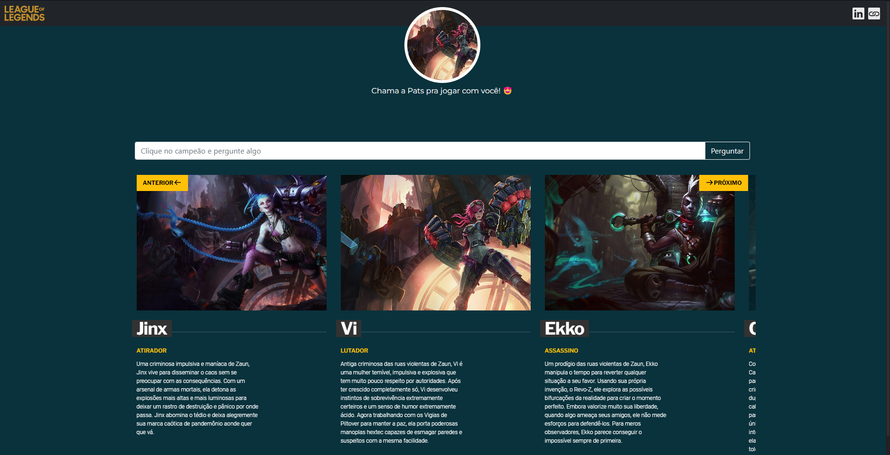
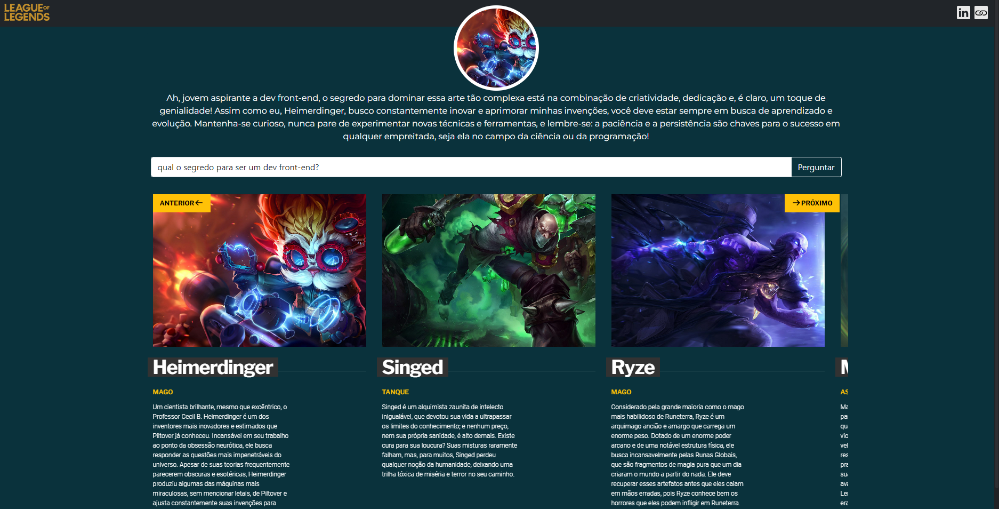

## 📚 Sobre o Projeto
Neste repositório, você encontrará o código-fonte do Front-end que consome uma REST API desse [repositório](https://ai.google.dev/tutorials/rest_quickstart#text-only_input) Back-end com Java Spring.

## 🖼️ Preview

